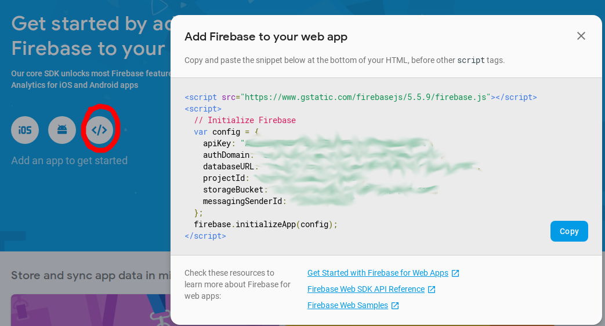

# edx_xblock_firepad

Installation
------------

Install package

    pip install -e git+https://github.com/raccoongang/edx_xblock_firepad.git#egg=edx_xblock_firepad

Add `firepad` to the list of advanced modules in the advanced settings of a course.

## Firebase credentials
1. Go to https://console.firebase.google.com/project
2. Select existing or create new project
3. Get the firebase credentials:

